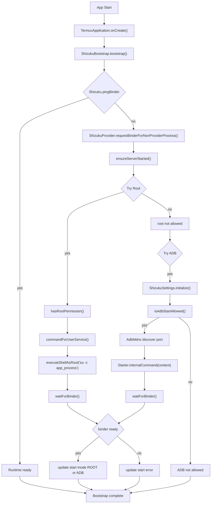
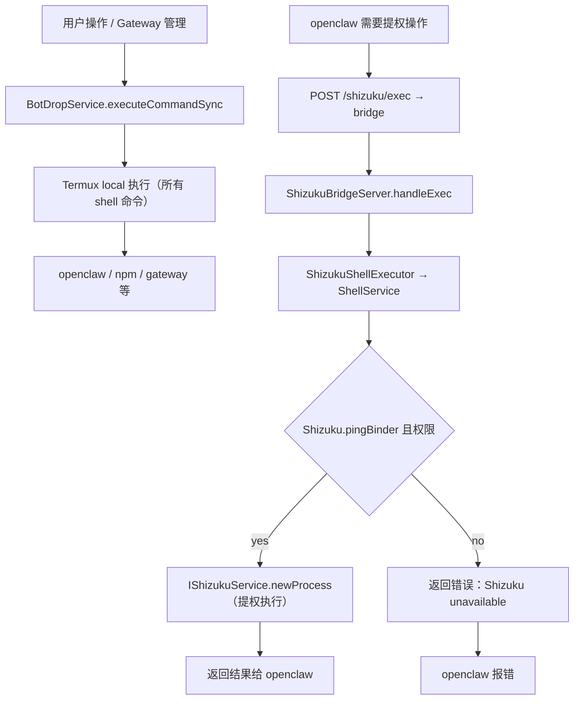
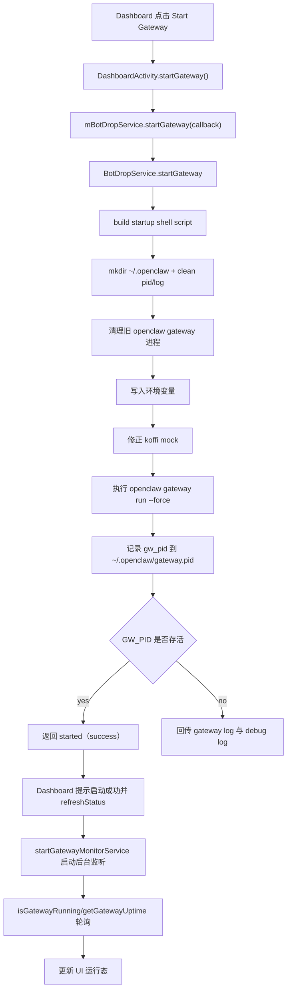
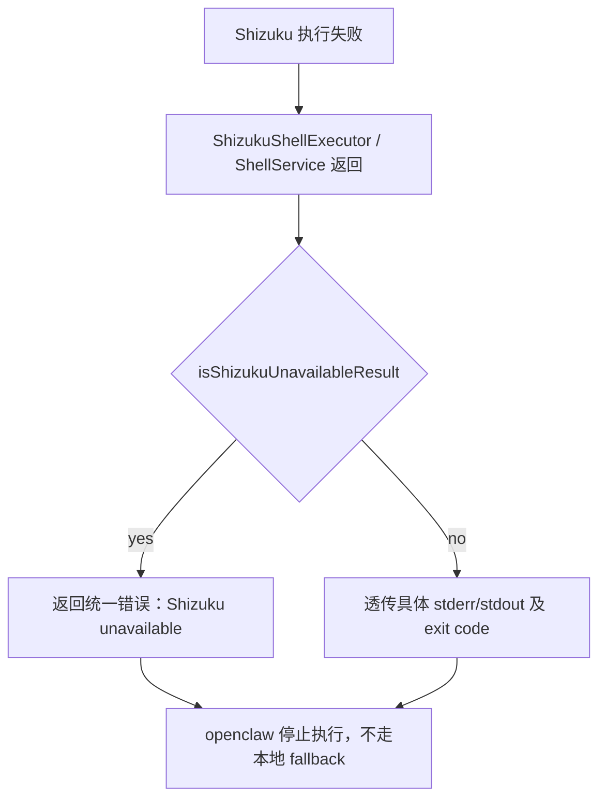
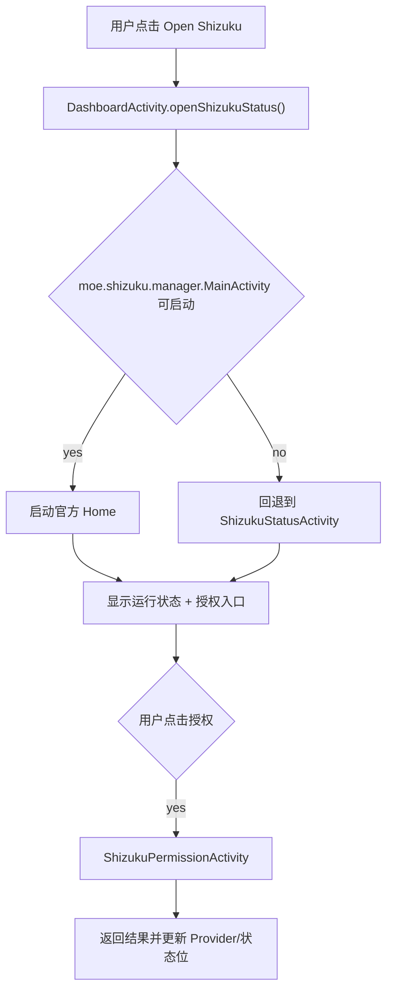

# BotDrop 单 App Shizuku 集成设计文档

版本：`feat/shizuku-single-app-merge`
更新日期：2026-02-21（修复执行边界与启动器问题）

本文档定义当前 BotDrop 里将 Shizuku 运行时与执行桥接内嵌到同一个 APK 的设计、启动路径和执行路径。目标是在不再依赖独立 Shizuku App 的前提下，保留官方 Shizuku 的能力并让 openclaw 命令走同源可控通道。

## 1. 设计目标

- 单 APK 内完成 Shizuku runtime 的启动与桥接，不再要求用户安装独立 `moe.shizuku.privilege` 应用。
- 保持现有 BotDrop 功能不回退，openclaw 运行在 Termux 环境中，通过 bridge 与 BotDrop app 通信。
- BotDrop app 通过 Shizuku API 执行需要提权的操作；shell 命令（openclaw、npm 等）始终走 Termux local 执行。
- 提供统一入口查看状态：官方 Home（若存在）与 Shizuku 状态页。
- 将 openclaw 与 Shizuku 的联动方式标准化到本地配置文件 `~/.openclaw/shizuku-bridge.json`。

## 2. 关键组件与职责

### 2.1 运行时初始化（官方路径）

- `com.termux.app.TermuxApplication`
  - 应用进程启动时在 `onCreate()` 中调用 `ShizukuBootstrap.bootstrap(context)`。
- `com.termux.shizuku.ShizukuBootstrap`
  - 先尝试 `ShizukuProvider.requestBinderForNonProviderProcess(context)` 获取 binder。
  - `Shizuku.pingBinder()` 不可用时进入 `ensureServerStarted(context)`。
  - 优先尝试 root 与 adb 两条启动路径，均通过 `waitForBinder(context)` 进行握手确认并持久化启动状态：
    - Root：`ServiceStarter.commandForUserService(...)` + `executeShellAsRoot`，执行 `app_process` 启动 `moe.shizuku.server.ShizukuService`；
    - adb：`ShizukuSettings.initialize(context)` + `AdbMdns` + `Starter.internalCommand(context)`。

### 2.1.1 官方对齐修订（已登记）

- `EXTRA_BINDER` key 与 `sendBinder()` 交互统一为官方值 `moe.shizuku.privileged.api.intent.extra.BINDER`（含 `ServiceStarter` 与 `ShizukuManagerProvider`）。  
- `ServiceStarter.sendBinder()` 增加官方风格响应校验：`reply.setClassLoader(...)`，并校验返回 binder 非空且 `pingBinder()` 成功。  
- 非 root adb 路径要求 `ShizukuSettings.initialize(context)` 先于 `getPreferences()` 使用。

### 2.2 Shizuku Provider / Receiver

- `AndroidManifest.xml`
  - 声明 `rikka.shizuku.ShizukuProvider`（authority: `${TERMUX_PACKAGE_NAME}.shizuku`）。
  - 声明 `com.termux.shizuku.ShizukuReceiver`（action `rikka.shizuku.intent.action.REQUEST_BINDER`）。
- `com.termux.shizuku.ShizukuReceiver`
  - 负责接收 provider 的 binder 请求并返回本进程 `Shizuku.getBinder()`。

### 2.3 本地桥接层（Embedded Shizuku Bridge）

- `app.botdrop.shizuku.ShizukuBridgeService`
  - 前台服务，负责启动 `ShizukuBridgeServer`，并写入 `~/.openclaw/shizuku-bridge.json`。
- `app.botdrop.shizuku.ShizukuBridgeServer`
  - 监听 `127.0.0.1:18790`（`/shizuku/status`, `/shizuku/exec`）；
  - 鉴权 token 校验 + 结果回写 JSON；
  - Shizuku 通路不可用时返回不可用错误，不做本地 fallback。
- `app.botdrop.shizuku.ShizukuShellExecutor`
  - 与 `ShellService` 的 AIDL 通道 (`IShellService`) 交互；
  - 提供连接、重连与结果解析能力。
- `app.botdrop.shizuku.ShellService`
  - 应用内 AIDL 服务，执行真实命令时优先走 Shizuku API；
  - 成功时调用 `IShizukuService.newProcess(...)`；
  - 失败时返回明确错误字符串（如 `Shizuku permission not granted`）。
- `app.botdrop.shizuku.IShellService`
  - 本地 AIDL 接口：`executeCommand` + `destroy`。

### 2.4 BotDrop 命令路由（Termux / Shizuku 边界）

- `app.botdrop.BotDropService`
  - 命令分发入口：`executeCommandSync(...)`；
  - **所有 shell 命令（openclaw、npm、gateway 管理等）走 Termux local 执行**，`shouldExecuteViaShizuku()` 始终返回 `false`；
  - Shizuku 仅用于 binder 级 API 操作（权限检查、状态查询等），不用于 shell 命令执行；
  - openclaw 通过 bridge（HTTP `127.0.0.1:18790`）向 BotDrop app 下达指令，BotDrop app 再通过 Shizuku API 连接私有 Shizuku 服务。
- `app.botdrop.GatewayMonitorService`
  - 保活网关运行态；不直接实现 Shizuku 执行逻辑，但与 command 路径串联。
- `app.botdrop.DashboardActivity`
  - 提供“Open Shizuku”入口；
  - 启动桥接服务（`startShizukuBridgeService()`）；
  - 打开官方/内置 Shizuku 状态页（`ShizukuStatusActivity`）。

## 3. 流程图

### 3.1 全局启动流程

### 3.2 命令执行流程（Termux / Shizuku 边界）

### 3.3 OpenClaw Gateway 启动流程

### 3.4 降级与回退

### 3.5 Dashboard -> 官方 Home / 状态页入口

## 4. 关键实现点（Method 级）

### 4.1 `ShizukuBootstrap.bootstrap(context)`
- `ShizukuProvider.enableMultiProcessSupport(false)`
- `ShizukuProvider.requestBinderForNonProviderProcess(context)`
- `Shizuku.pingBinder()` 短路返回
- 失败时进入 `ensureServerStarted(context)`，尝试：
  - `startWithRoot()`：`hasRootPermission()`、`ServiceStarter.commandForUserService(...)`、`executeShellAsRoot(command)`、`waitForBinder(context)`；
  - `startWithAdb()`：`ShizukuSettings.initialize(context)`、`isAdbStartAllowed()`、`AdbMdns`、`Starter.internalCommand(context)`、`waitForBinder(context)`。

### 4.2 `BotDropService.executeCommandSync(command, timeoutSeconds)`
- 所有 shell 命令走 `executeCommandViaLocal`（Termux 环境）；
- `shouldExecuteViaShizuku()` 始终返回 `false`，确保 Termux / Shizuku 边界清晰；
- Shizuku 通道仅由 openclaw 通过 bridge HTTP 接口按需调用，不在 BotDropService 命令路由中使用。

### 4.3 `ShizukuBridgeServer.handleExec`
- 解析 JSON body：`command`, `timeoutMs`, 可选 `env`；
- token 校验失败返回 `401`;
- 若 executor 可用，优先执行 `mExecutor.executeSync`;
- 关键异常直接返回不可用：
  - `Shizuku unavailable: ...`
- 不执行本地 fallback。

### 4.4 `ShellService.createShizukuProcess`
- 关键检查：
  - `Shizuku.pingBinder()`
  - `Shizuku.checkSelfPermission() == PERMISSION_GRANTED`
- 执行：
  - `IShizukuService.Stub.asInterface(Shizuku.getBinder())`
  - `service.newProcess(selectCommand(command), env, null)`
- 失败返回统一 stderr，便于网关链路诊断。

## 5. 配置与入口

- 网桥配置文件：`~/.openclaw/shizuku-bridge.json`
  - `host: 127.0.0.1`
  - `port: 18790`
  - `token: <random>`
- Dashboard：
  - “Open Shizuku”按钮 → `DashboardActivity.openShizukuStatus()`
    - 优先尝试启动内部 `moe.shizuku.manager.MainActivity`（存在则启动）；
    - 失败则打开 `ShizukuStatusActivity`（自动启动运行时+请求权限）。

## 6. 与官方 Shizuku 的一致性与偏差

- 一致性
  - 保留官方 runtime 类与协议链（`ShizukuProvider`, `Shizuku`, `IShizukuService`）。
  - 通过 `ServiceStarter`/`commandForUserService` 完成 server 级启动。
  - 权限确认仍走 `Shizuku.requestPermission` 与 `ShizukuPermissionActivity`。
- 偏差
  - 官方“独立应用”模式下，runtime 与管理 UI 分离安装；
  - 当前实现是单 App 内嵌模型：管理入口和 gateway 桥接共同存在于 BotDrop 包内。
  - 当前与官方差异集中在非 root 回退链路：`EXTRA_BINDER` 常量、`sendBinder` 回包校验、`ShizukuSettings` 初始化时序；这三点为当前稳定性关键项。

## 7. 风险与验证点

### 7.1 风险
- Shizuku 权限未授予导致所有 `newProcess` 失败；
- Root 丢失导致 runtime 无法启动；
- `ShizukuBridgeService` 被系统回收后，bridge 配置文件丢失；
- `openclaw` 与 shizuku 不可用错误的可观测性不足（需命令级日志）。

### 7.2 验证项
- 启动日志应出现：
  - `ShizukuBootstrap.bootstrap`
  - `ShizukuBridgeService` `Start command`
  - `ShizukuBridgeServer started on 127.0.0.1:18790`
  - `writeBridgeConfig ... shizuku-bridge.json`
- `ShizukuPermissionActivity` 出现时，确认当前应用授权状态。
- openclaw 路径命令日志应显示执行分支：
  - `execute via shizuku bridge`
  - `Shizuku unavailable`（仅在确实失败时出现）。

## 8. 2026-02-21 修复记录

### 8.1 双启动器图标
- **问题**：`manager` 模块的 `AndroidManifest.xml` 声明了 `LAUNCHER` intent-filter，导致安装后出现两个图标。
- **修复**：注释掉 `manager/src/main/AndroidManifest.xml` 中 `MainActivity` 的 `<category android:name="android.intent.category.LAUNCHER" />`。

### 8.2 `ShizukuRemoteProcess.waitFor` 异常
- **问题**：`ShizukuRemoteProcess` 未覆写 `waitFor(long, TimeUnit)`，Java 默认实现轮询调用 `exitValue()`，Shizuku IPC 抛 `RuntimeException("process hasn't exited")` 而非 `IllegalThreadStateException`，导致异常穿透。
- **修复**：在 `ShizukuRemoteProcess` 中覆写 `waitFor(long, TimeUnit)`，委托给 `remote.waitForTimeout()`。

### 8.3 Termux / Shizuku 执行边界
- **问题**：`BotDropService.shouldExecuteViaShizuku()` 对所有命令返回 `true`，导致 `openclaw --version` 等 shell 命令走 Shizuku shell（uid=2000 无权访问 app 私有目录），precheck 报 exit=127。
- **修复**：`shouldExecuteViaShizuku()` 改为始终返回 `false`。所有 shell 命令走 Termux local 执行，Shizuku 仅用于 binder API 操作。
- **架构明确**：openclaw（Termux）→ bridge HTTP → BotDrop app → Shizuku API → 私有 Shizuku 服务。

## 9. 后续迭代建议

1. 将 `ShizukuManager` 与官方状态 API 对齐（补齐真实状态映射：NOT_INSTALLED / NOT_RUNNING / NO_PERMISSION / READY）；
2. 在 `ShizukuBridgeServer` 增加 request_id 和标准响应码；
3. 增加官方 home 入口与内嵌入口的统一跳转策略（减少重复弹窗）；
4. 将 `isShizukuUnavailableResult` 与标准错误码归一化，提升故障自恢复比率。

### 9.1 APK 包体优化（当前 200+ MB）

- 目标：在功能不回退前提下，优先将 APK 降到可接受范围（优先目标 < 140 MB，先期目标 < 160 MB）。
- 动作项：
  - 梳理 `app` 与 `shell` 模块引用的 ABI，移除非目标架构产物：先评估 `x86/x86_64` 是否必要，仅保留 `armeabi-v7a/arm64-v8a`；
  - 检查 `build.gradle` 的 `packagingOptions`，移除不需要的 `androidTest`、调试、符号和重复资源，启用 `jniLibs.useLegacyPackaging=false`；
  - 将大体积 native 组件改为按需加载（如 `ffmpeg`、终端相关重资源）并通过可选功能入口延迟初始化；
  - 对 `res`/`assets` 做体积扫描（AAPT2 + `du`/`gzip`），清理未使用的图标、语言包、重复的矢量/位图（含旧版演示图）；
  - 引入 `R8` 压缩规则：
    - 去除未使用类/反射路径的保留规则，优先在 `consumerProguardFiles` 中收敛；
    - 确认 `keep` 范围仅覆盖 AIDL/反射入口与序列化模型。
- 验收：
  - 产物报告输出 `./gradlew :app:assembleDebug` 后记录 APK 容量曲线；
  - 每轮优化后新增 `APK size report`，比对去重率与下载体积。

### 9.2 Shizuku 集成 UI 体验优化

- 目标：从“直接迁移”改为“单 App 内聚体验”，减少跳转成本和权限配置成本。
- 动作项：
  - 重构 Shizuku 相关界面文案与布局为 BotDrop 风格（文案、图标、按钮顺序、空态/错误态）；
  - 统一 `官方 Home` 与内置 `ShizukuStatusActivity` 的入口逻辑：  
    - 已安装官方管理器时走官方入口；
    - 未安装时直接进入内置页，并提供“重新授权”与“刷新运行状态”主操作；
  - 把状态显示从“事件型弹窗”改为“可读 Dashboard 片段”：运行态、权限态、启动方式、最近错误原因、重试入口；
  - 增加“首屏引导”与“故障指引”卡片（root/ADB、授权、USB 调试、Binder 不可达）；
  - 增加交互一致性：启动、授权、重试、恢复按钮使用统一 loading/禁用态策略。
- 验收：
  - 完整链路 1 次点按内从“启动 Shizuku”到“执行 openclaw 权限动作”不超过 3 次跳转；
  - 用户可在单页看到当前启动模式、权限状态和下一步建议，减少来回退回。

### 9.3 提升 Shizuku 图片读取稳定性

- 目标：解决 uiautomator 在部分机型返回缓存图导致“截图与控件树不一致”的问题。
- 动作项：
  - 在截图与控件树采集链路打通“版本戳/窗口版本”校验：  
    - 截图任务附带 `capture_ts + rotation + displayId + rootHierarchyVersion`；  
    - 读取层回执对比版本戳，不一致则自动重试；
  - 对 uiautomator/Accessibility 回执增加去重与短期失效策略：  
    - 相同 hash 快速过滤时校验 `mViewRoot`/`bounds` 变化；
    - 发现不一致时抛弃缓存，触发强制刷新（新会话/窗口同步）；
  - 引入二级数据源兜底：当 uiautomator 与截图时间差超过阈值时，先做轻量 `window/contentchange` 再采集；
  - 记录 `screenshotId`、`uiautomatorDumpId` 与执行链路到本地日志，便于排查“错位”案例；
  - 预留兼容路径：对已知问题机型（小米/部分华为/三星）做厂商白名单降级策略（适当拉长刷新间隔、增加重试次数）。
- 验收：
  - 在重现场景下对比“截图”和“控件树”匹配率；
  - 采集失败后可自动重试并在 1～2 次内恢复；
  - 生成可观测指标：`cached_hit_vs_fresh_rate`、`stale_dump_count`、`pairing_mismatch_count`。
